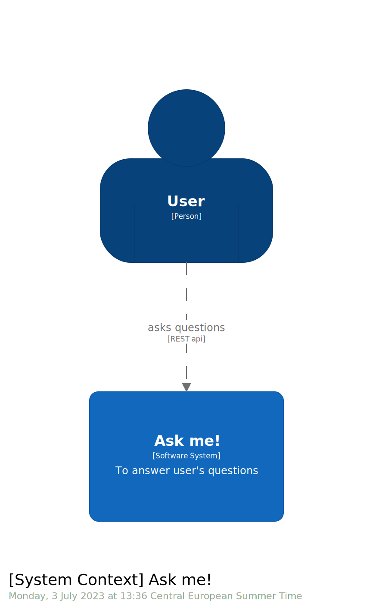
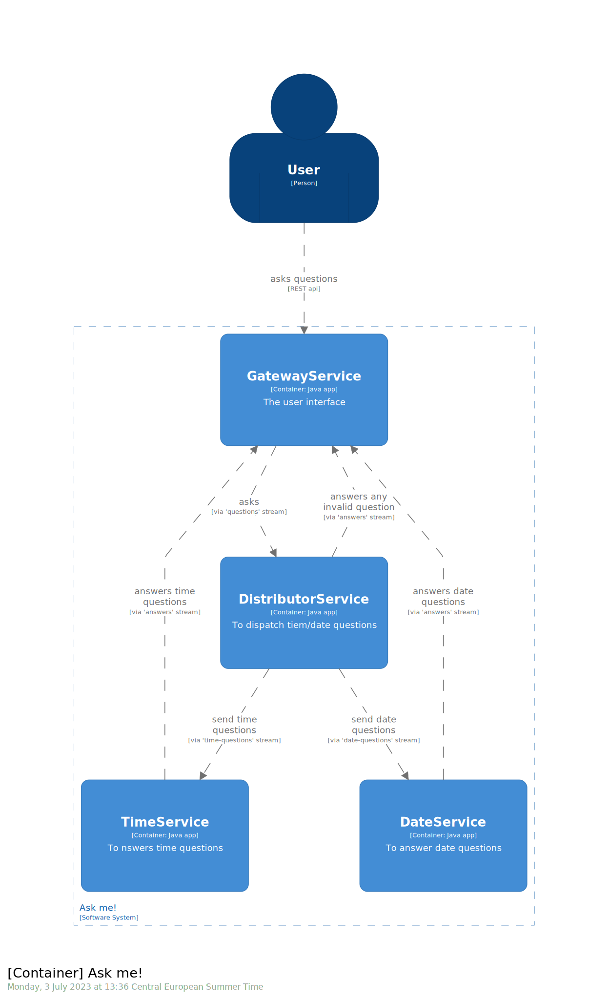

# Spring Cloud Stream: Sample Project

- [Spring Cloud Stream: Sample Project](#spring-cloud-stream-sample-project)
  - [Disclaimer](#disclaimer)
  - [License](#license)
  - [Project Structure](#project-structure)
    - [System Context:](#system-context)
    - [Microservices landscape at container level:](#microservices-landscape-at-container-level)
    - [Communication between services via SC-Stream](#communication-between-services-via-sc-stream)

This project aims to provide a simple yet complete example of how Spring Cloud Stream can facilitate the communication between microservices.

## Disclaimer

to do.

## License

to do.

## Project Structure

### System Context:

### Microservices landscape at container level:

### Communication between services via SC-Stream

* User asks a question
* Gateway gets the question and sends to DistributorService
* DistributorService distributes the question to either TimeService or DateService
    * based on the question type
* TimeService or DateService provides the answer
* Gateway sends the answer back to User

**Note:** all the communications are done via Stream 'topics' including: *Question, Answer, TimeQuestion, DateQuestion*

